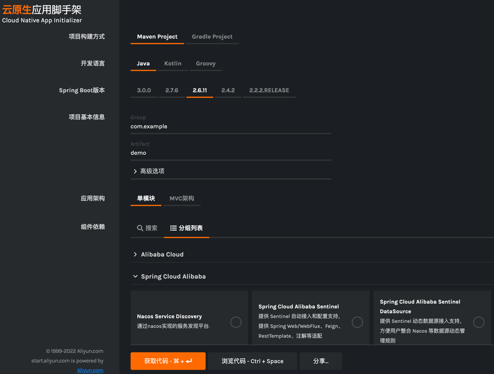
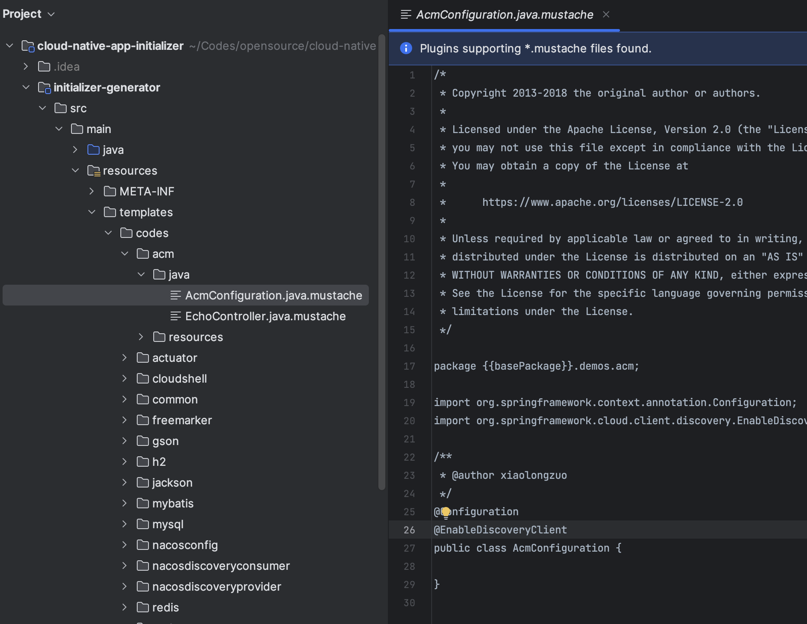

# 如何自定义脚手架内容

云原生应用脚手架默认包含的依赖和代码，并不一定适合所有用户的使用。例如，有些同学需要增加一些自己的依赖或者实例代码，又或者是修改父pom并在自己的环境中使用。
大部分情况下，对平台数据的定制是非常主要的定制诉求，其次才是其他功能性的定制需求，本文着重介绍如何自定义平台的数据部分。



脚手架的数据分为以下两个部分：

- 元数据：一组以yaml格式维护的数据集，包含：Spring Boot 版本、Jdk 版本、可选依赖等等相关信息；
- 代码模板：一系列使用 mustache 语法，按照组件维度维护的代码片段，在选择对应的组件时自动渲染这部分示例代码；

## 元数据
默认的版本中自带了一套默认的元数据配置，存放在 `initializer-generator/src/main/resources/metadata.yaml`下。

如果需要修改这个配置的加载路径，可以通过更改参数 `application.metadata-path`的值来实现。例如，如果在本地有一个元数据配置文件，存放在 `/home/theonefx/meta.yaml`，则将这个值设置到`application.metadata-path`上即可。

当然你也可以使用 Spring Boot 的 profile 以及配置加载机制来实现更多的配置方式。不过需要注意的是，设置了自定义配置文件以后，原有的元数据配置将不再生效；

### 元数据配置字段
| 字段 key | 说明 |
| --- | --- |
| initializr.env.boms | 以 Bom 方式引入的依赖信息，关键维护了 bom 的坐标，以及跟 Spring Boot 版本的映射关系； |
| initializr.env.gradle | gradle的基本配置，默认即可 |
| initializr.env.platform | 平台API的版本，默认即可 |
| initializr.env.repositories | 依赖中，如果有需要单独声明的所在仓库信息，这里是对应的仓库列表 |
| initializr.dependencies | 分组管理的平台可选依赖，这里是数据定制的重要配置。 详见下文 |
| initializr.types | 构建工具以及输出的工程格式配置，maven、gradle | 
| initializr.packagings | 指定最终的编译打包方式，jar 包或者是 war 包 |
| initializr.javaVersions | java 的可选版本，以及默认值 | 
| initializr.languages | 项目使用的语言：java 、kotlin、groovy | 
| initializr.bootVersions | Spring Boot 的可选版本以及默认值 |
| initializr.architecture | 架构的可选项，以及相关模块配置。默认的 none 单模块一定要有 详见下文 |


### 版本范围
由于平台使用了 spring.initializr 作为底层框架，所以必须依赖于其提供的版本范围概念（该范围特指 Spring Boot 的版本）。这里可以直接访问 Spring 的文档以确认版本范围的规范：
[Spring 范围文档](https://docs.spring.io/initializr/docs/current-SNAPSHOT/reference/html/#dependencies-compatibility-range)
### 组件依赖配置
```yaml
dependencies:
  - name: Spring Cloud Alibaba
    bom: spring-cloud-alibaba
    compatibilityRange: "[2.0.0.RELEASE,2.6.11]"
    content:
      - name: Nacos Service Discovery
        id: sca-nacos-discovery
        description: 通过nacos实现的服务发现平台.
        groupId: com.alibaba.cloud
        artifactId: spring-cloud-starter-alibaba-nacos-discovery
        starter: false
        links:
          - rel: reference
            href: https://spring-cloud-alibaba-group.github.io/github-pages/hoxton/en-us/index.html#_spring_cloud_alibaba_nacos_discovery
          - rel: guide
            href: https://github.com/alibaba/spring-cloud-alibaba/blob/master/spring-cloud-alibaba-examples/nacos-example/nacos-discovery-example/readme.md
            description: Nacos Service Discovery Example
```
组件依赖，有两层配置，外层称为“依赖分组”，内层为具体的组件依赖：

- 依赖分组
    - name： 分组名称；
    - bom：对应引入的 bom，可选，如果配置了 bom 则版本依赖全部由 bom 控制；
    - compatibilityRange：版本范围，可选。如果配置该值代表支持的 Spring Boot 版本范围，如果不配置则不关注Spring Boot 版本；
    - hide: 是否在 metadata api 中显示这个分组；
    - content：具体组件依赖
- 组件依赖
    - id：依赖的唯一标识，需要全局唯一
    - name：依赖名称，展示用
    - description：依赖描述，展示用
    - groupId、artifactId：依赖坐标
    - starter：是否是 Spring Boot 的 starter
    - links：用于生成 help 文档中放置的关联连接
    - hide: 是否在 metadata api 中显示这个依赖
    - codeOnly: 如果为 true，那么在选择这个组件时，不会增加任何 maven 或者是 gradle 依赖，而只会添加对应的示例代码
    - dependencies: 当前组件依赖的次级组件id，当前选择该组件时，这个属性设置的次级组件也会被同步选择上
### 架构配置
```yaml
architecture:
  - id: none
    name: 单模块
    default: true
  - id: mvc
    name: MVC架构
    subModules:
      - name: start
        description: 入口模块，引导工程启动以及基础配置
        main: true
      - name: web
        description: web 模块，对应 MVC 的 V 概念，存放视图层的逻辑
      - name: service
        description: service 模块，对应 MVC 的 M 概念，存放核心业务逻辑代码
```

支持多个架构

- id：架构的唯一标识，默认的 none 必须有
- name：架构名称
- default：是否默认架构，该值影响到浏览器默认选择
- subModules：多架构的子模块配置
    - name：子模块名称
    - description：子模块说明
    - main：是否是入口模块
## 代码模板
### 模板加载&目录
默认情况下，代码模板存放在 `initializer-generator/src/main/resources/templates/codes`目录下，如下图：


如果需要在另外的地方维护代码模板，可以通过设置 `application.democode-path`参数实现。

代码模板目录下， 按照 `组件依赖.id`来隔离各个组件的代码模板，其一层目录是根据语言、类型存放模板文件，如下：
```
.
├── groovy
│   ├── BasicController.groovy.mustache
│   ├── PathVariableController.groovy.mustache
│   └── User.groovy.mustache
├── java
│   ├── BasicController.java.mustache
│   ├── PathVariableController.java.mustache
│   └── User.java.mustache
└── resources
    ├── application.properties.mustache
    └── static
        └── index.html.mustache

```

- java：存放 java 语言的代码模板
- groovy： 存放 groofy 语言的代码模板
- kotlin：存放 kotlin 语言的代码模板
- resources：通用的配置文件，放在目标工程的 resource 目录下

由于 java 语言要求 .java 文件必须放在与包名一致的文件目录下，在维护代码模板时，这个规范会导致模板目录层数过多。所以这里给出了一个便捷方法，代码模板不需要按照包名维护，只需要声明好 package 即可，生成代码时会根据 package 的值自动创建正确的目录。

### 模板变量
平台默认支持一些模板变量，用于代码模板的编写：

| 变量 | 说明 | 实例值 |
| --- | --- | --- |
| appShotName | 项目简短名称 | app |
| applicationName | 项目全名 | Application |
| basePackage | 项目的base包路径 | com.theonef.testapp |
| version | 项目版本 | 1.0 |
| spring-boot.version | Spring Boot 版本 | 2.2.6.RELEASE |
| java.version | jdk 版本 | 1.8 |
| artifactId | 项目坐标 | testapp |
| groupId | 项目坐标 | com.theonef |
| module | 当前模块 | web |

# 运行方式自定义
## JDK 本地启动
这个很简单，jdk 的启动方式、maven 的启动方式都可以用来启动脚手架工程：
### jdk
```bash
mvn package
java -jar initializer-generator/target/initializer-generator-0.8.jar
```
### maven
```bash
cd initializer-generator
mvn spring-boot:run
```

## Docker 启动
```bash
docker pull registry.cn-hangzhou.aliyuncs.com/cloud-native-app-initializer/initializer:latest
docker run -it -p 127.0.0.1:7001:7001 registry.cn-hangzhou.aliyuncs.com/cloud-native-app-initializer/initializer:latest
```
当然，你可以通过参数的方式，通过指定 DEMOCODE_PATH 和 METADATA_PATH 的方式来修改元数据以及代码模板的配置；

